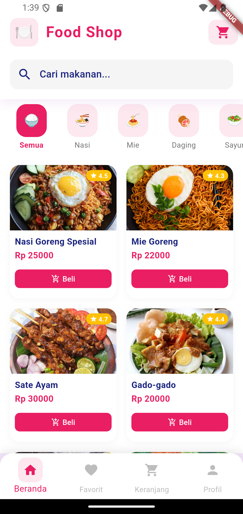
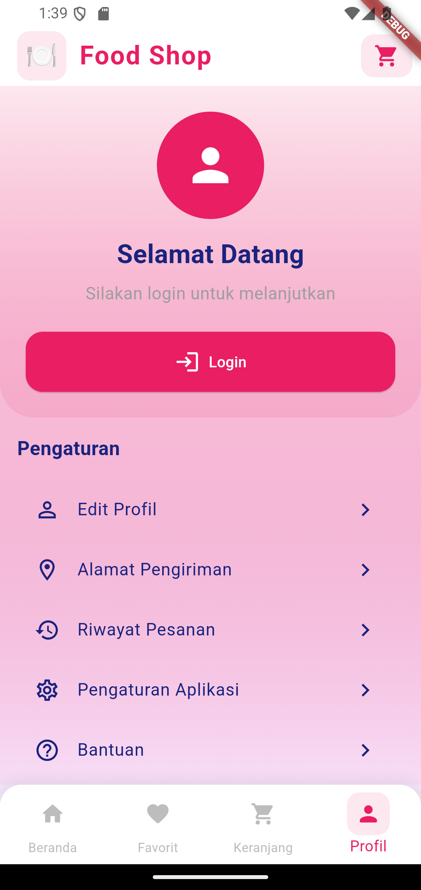

# 🍽️ Food Shop App

Aplikasi Food Shop adalah aplikasi mobile yang dibangun menggunakan Flutter untuk memudahkan pengguna memesan makanan favorit mereka. Aplikasi ini menampilkan antarmuka yang modern dan intuitif dengan fitur-fitur yang berguna.


## ✨ Fitur

- 🏠 **Beranda yang Informatif**
  - Daftar makanan dengan gambar yang menarik
  - Informasi detail seperti harga dan rating
  - Fitur pencarian makanan
  
- 💝 **Favorit**
  - Simpan makanan favorit Anda
  - Akses cepat ke menu yang sering dipesan
  
- 🛒 **Keranjang Belanja**
  - Tambahkan makanan ke keranjang
  - Lihat total pesanan
  - Proses checkout yang mudah
  
- 👤 **Profil Pengguna**
  - Manajemen akun yang simpel
  - Riwayat pesanan
  - Pengaturan profil

## 🚀 Teknologi

- ⚡ Flutter 3.0+
- 🎯 Dart 3.0+
- 📱 Material Design 3
- 🎨 Custom Theme & Animations

## 📂 Struktur Proyek

```
lib/
  ├── src/
  │   ├── config/
  │   │   └── theme.dart
  │   ├── features/
  │   │   └── food/
  │   │       ├── models/
  │   │       ├── repositories/
  │   │       ├── widgets/
  │   │       └── pages/
  │   └── common/
  │       └── widgets/
  └── main.dart
```

## 🛠️ Instalasi

1. **Prasyarat**
   ```bash
   flutter --version
   # Flutter 3.0.0 atau lebih tinggi
   ```

2. **Clone Repository**
   ```bash
   git clone https://github.com/Galang0304/FOOD_SHOP.git
   cd FOOD_SHOP
   ```

3. **Install Dependencies**
   ```bash
   flutter pub get
   ```

4. **Jalankan Aplikasi**
   ```bash
   flutter run
   ```

## 📱 Screenshot

| Beranda | Favorit | Keranjang | Profil |
|---------|---------|-----------|---------|
|  |  |  |  |

## 🎯 Fitur Mendatang

- [ ] Integrasi pembayaran online
- [ ] Sistem review dan rating
- [ ] Notifikasi real-time
- [ ] Tracking pesanan
- [ ] Dark mode
- [ ] Multi-bahasa

## 🤝 Kontribusi

Kontribusi selalu diterima dengan senang hati! Silakan baca [CONTRIBUTING.md](CONTRIBUTING.md) untuk detail lebih lanjut tentang proses pengajuan pull request kepada kami.

## 📄 Lisensi

Proyek ini dilisensikan di bawah Lisensi MIT - lihat file [LICENSE](LICENSE) untuk detail lebih lanjut.

## 👨‍💻 Pengembang

- **Andi Arya Galang** - *Initial work* - [Galang0304](https://github.com/Galang0304)

## 🙏 Pengakuan

- Terima kasih kepada semua kontributor yang telah membantu proyek ini
- Inspirasi desain dari berbagai aplikasi food delivery populer
- Icon dan gambar dari berbagai sumber terbuka

## 📞 Kontak

Jika Anda memiliki pertanyaan atau saran, silakan hubungi pengembang di:
- Email: andiariegalang0@gmail.com
- GitHub: [@Galang0304](https://github.com/Galang0304)
- LinkedIn: [Andi Arya Galang](https://www.linkedin.com/in/andi-arya-galang-482906347/)

---
⭐ Jangan lupa beri bintang jika Anda menyukai proyek ini!
